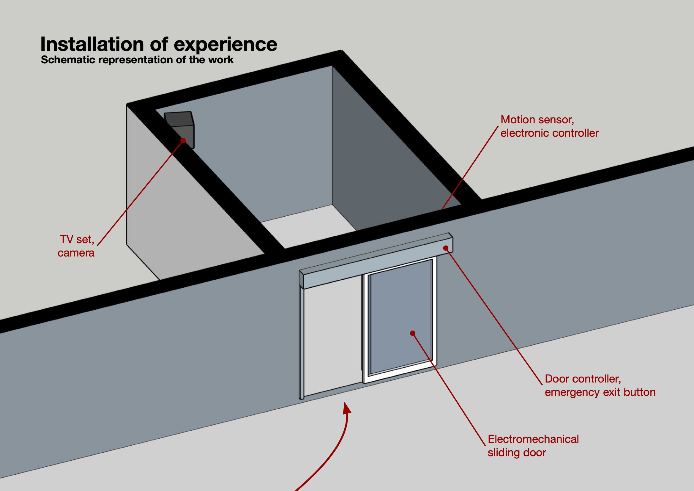
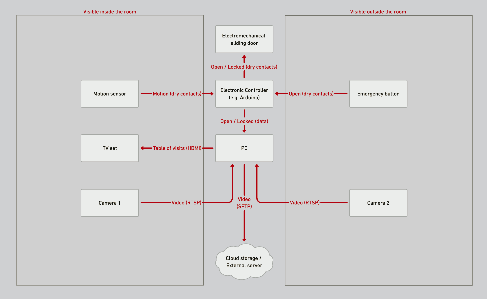
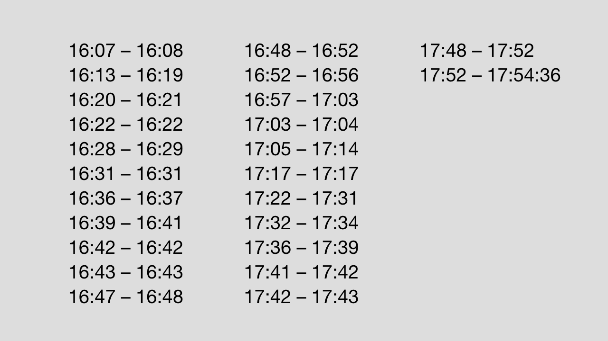

# Installation of Experience, 2011

The source code for the interactive installation titled "Installation of Experience". Originally produced in 2011 for the exhibition in Laboratoria Art & Science, Moscow, Russia. The author of the installation is [Valentin Fetisov](http://valiafetisov.com/).

## Project description

The work consists of a small room with a sliding door at the entrance and a TV set inside. The door is normally open but closes as soon as a visitor comes in to see what’s on TV, effectively trapping them for an unknown amount of time without any instructions on how to get out.

The way out of the room is very simple but far from being obvious: a visitor should do nothing or, in other words, should give up trying. But, of course, many people use their previous experience of interactions to find the invisible interface: wave hands, jump, try to interact with any switches in the room and ask for help.

In this work, the artist was personally interested in people who, despite the "interactive art" framing and the rules it imposes, actively resist the situation by trying to force the door open rather than conforming to the expected behavior. The doors are always installed in such a way as to make this possible.

## The scope of this repository

### [Sketch](sketch/) folder

Contains Arduino/C++ code to run on a controller like Arduino. The controller suppose to be connected to 1) Electromechanicall sliding door (using its dry lock/unlock contacts) 2) Motion sensor 3) Emergency button 4) The PC. The purpose of the code is to measure "inactivity duration" in the room using motion sensor, open or close sliding door and notify the PC about the state of the room.

### [Web-app](web-app/) folder

Contains Node/Meteor.js code to run on a PC / bigger controller like Raspberry PI, connected to the Arduino, the TV and the internet. The purpose of the code is to receive signal from Arduino controller regarding the state of the room, keep database with every visit to the room, record videos and upload them to a remote server. The server also exposes a small web page which shows realtime data of the recorded visits, to be displayed on the TV in the room.

An example screenshot from the TV with real-time information about the last and a few previous visits:

